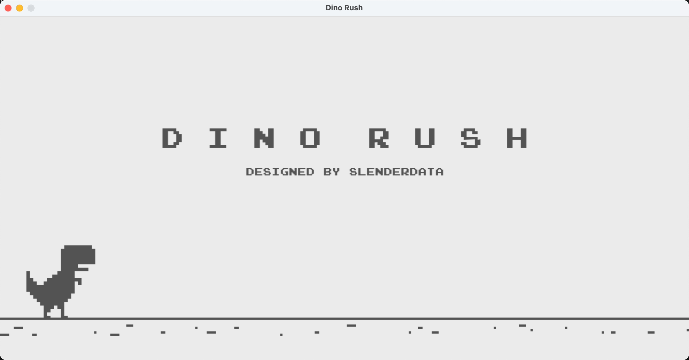

<!-- PROJECT LOGO -->
<br />
<div align="center">
  

<h3 align="center">DinoController</h3>

</div>


<!-- TABLE OF CONTENTS -->
<details>
  <summary>Table of Contents</summary>
  <ol>
    <li>
      <a href="#about-the-project">About The Project</a>
    </li>
    <li>
      <a href="#getting-started">Getting Started</a>
      <ul>
        <li><a href="#installation">Installation</a></li>
        <li><a href="#usage">Usage</a></li>
      </ul>
    </li>
    <li><a href="#contributing">Contributing</a></li>
    <li><a href="#license">License</a></li>
    <li><a href="#acknowledgments">Acknowledgments</a></li>
  </ol>
</details>


<!-- ABOUT THE PROJECT -->
## About The Project
<div align="center">

</div>
This is a simple controller for the Dino game. You can use the mouth to control the game or jump to control the game.

<p align="right">(<a href="#readme-top">back to top</a>)</p>


## Getting Started

This is an example of how you may give instructions on setting up your project locally.
To get a local copy up and running follow these simple example steps.


### Installation

1. Clone the repo
   ```sh
   git clone https://github.com/qqizhao/DinoController
   ```
2. Install python packages
   ```sh
   pip install -r requirements.txt
   ```
<p align="right">(<a href="#readme-top">back to top</a>)</p>

### Usage

1. Start the game
```sh
cd Dino-game  
python Game.py
```
2. Open a new terminal and start the controller
```sh
# if you want to use the mouth to control the game
python mouthCon.py  
# if you want to jump to contro the game
python jumpCon.py
```
- **Note: Click the game window before starting the controller.**

<p align="right">(<a href="#readme-top">back to top</a>)</p>


<!-- CONTRIBUTING -->
## Contributing

Contributions are what make the open source community such an amazing place to learn, inspire, and create. Any contributions you make are **greatly appreciated**.

If you have a suggestion that would make this better, please fork the repo and create a pull request. You can also simply open an issue with the tag "enhancement".
Don't forget to give the project a star! Thanks again!

1. Fork the Project
2. Create your Feature Branch (`git checkout -b your-branch-name`)
3. Commit your Changes (`git commit -m 'Add some AmazingFeature'`)
4. Push to the Branch (`git push origin your-branch-name`)
5. Open a Pull Request

<p align="right">(<a href="#readme-top">back to top</a>)</p>


<!-- LICENSE -->
## License

Distributed under the MIT License. See `LICENSE.txt` for more information.

<p align="right">(<a href="#readme-top">back to top</a>)</p>


<!-- ACKNOWLEDGMENTS -->
## Acknowledgments

* [Dino-Rush](https://github.com/SlenderData/Dino-Rush)


<p align="right">(<a href="#readme-top">back to top</a>)</p>